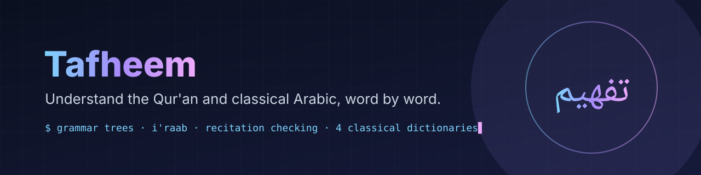

**[Open the app](https://tafheem-app.vercel.app)**

Understand Quranic and classical Arabic, word by word. Grammar, morphology, the Quran and four classical dictionaries in one study app.

Built on real corpora and classical references. AI explanations are optional; the core app runs fully offline.

## Features

| Tab | What it does |
|---|---|
| **Nahw** | Tarkeeb (sentence tree) and I'raab (word-by-word case and function) with proof citations. Includes 47 worked examples from *Tasheel al-Nahw* and a tree for any ayah. |
| **Sarf** | Root extraction, verb patterns and conjugation tables |
| **Quran** | Search and look up any ayah, with optional deep analysis |
| **Daleel** | Find the passage in the classical books, asked in Arabic or English, with the source and location of every quote |
| **Memorise** | A printed mushaf page with words removed; type them back or pick from four |
| **Dictionary** | Arabic and English search, built from the Wiktionary Arabic extract |
| **Quiz** | Practice questions generated for any sentence |
| **Timelines** | Five eras from Adam onward, with about fifty events to read |

## Stack

| Layer | Tech |
|---|---|
| Frontend | React 19, Vite, Tailwind CSS, TanStack Query |
| Backend | FastAPI, Pydantic, PyArabic |
| Data | Quranic corpus (SQLite), Wiktionary dictionary (JSON), grammar rules |
| AI (optional) | Groq or local Ollama |
| Hosting | Landing page on Vercel, app on an Oracle Cloud VM (see [deploy/](deploy/README.md)) |

## Run locally

Needs Python 3.10+ and Node 18+.

```bash
./start.sh
```

Or by hand, from the project root:

```bash
python -m venv venv && source venv/bin/activate
pip install -r requirements.txt && pip install --no-deps -r requirements-nodeps.txt
python -m uvicorn backend.main:app --reload     # API on :8000

cd frontend && npm install && npm run dev       # app on http://localhost:5173
```

Optional: set `GROQ_API_KEY` in `.env` for AI explanations ([free key](https://console.groq.com/keys)).

## API

| Method | Endpoint | Purpose |
|---|---|---|
| POST | `/api/analyze` | I'raab analysis of a sentence |
| GET | `/api/tarkeeb/examples` | Worked tarkeeb trees |
| GET | `/api/quran/{surah}/{ayah}/tarkeeb` | Tarkeeb tree of one ayah |
| POST | `/api/morphology` | Sarf breakdown of a word |
| GET | `/api/quran/{surah}/{ayah}` | Ayah lookup |
| GET | `/api/quran/search` | Quran search |
| GET | `/api/dictionary/search` | Dictionary lookup |
| POST | `/api/practice` | Practice questions |
| GET | `/api/health` | Health check |

## Layout

```
backend/    FastAPI app: routers, services, models, data
frontend/   React app: components, lib, api client
deploy/     server setup for the Oracle VM
tests/      backend tests
docs/       design notes and research
```

## Tests

```bash
pytest                      # backend
cd frontend && npm test     # frontend
```

## Troubleshooting

| Problem | Fix |
|---|---|
| `GROQ_API_KEY not set` | only needed for AI features; add it to `.env` and restart |
| `Ayah not found` | surah is 1 to 114; check the ayah number |
| Empty dictionary | build it: `python backend/scripts/build_dictionary.py` |

## Data and licensing

Uses openly licensed sources only. Hans Wehr is under copyright and is not shipped. Respect the terms of each external resource.
