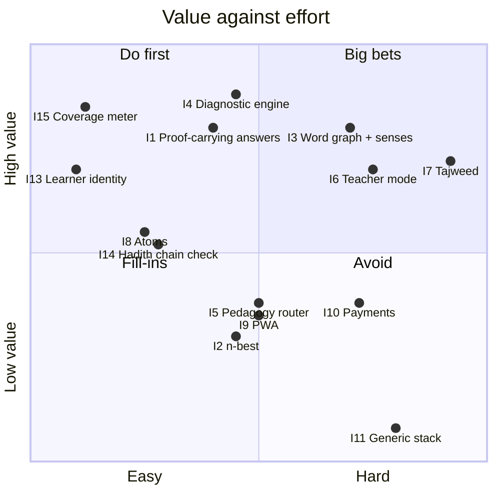

# Step 3. Impact against complexity (the risk assessment)

## 3.1 How each idea is scored

Each idea gets 4 scores from 1 to 5, plus a size:

- **Learner (L)**: does a real person understand or remember more of the Qur'an?
- **Business (B)**: does it help us get users, keep them, or get paid?
- **IP (P)**: is it hard to copy? This counts data, know-how and trust, not only patents. See `../4-research/`.
- **Fit (F)**: how well does it plug into what is already built? 5 means the parts already exist.
- **Size (C)**: S = 1, M = 2, L = 3, XL = 4. Taken from the audit's estimates.

**Priority = (L + B + P) × F ÷ C.** The formula rewards value that is cheap to reach from where we stand.

## 3.2 Scores

| ID | Idea | Status now | L | B | P | F | C | **Priority** |
|---|---|---|---|---|---|---|---|---|
| I15 | Qur'an coverage meter | missing, parts exist | 5 | 4 | 2 | 5 | S | **55** |
| I13 | Learner identity (one record each) | missing, designed-for | 4 | 5 | 1 | 5 | S | **50** |
| I1 | Verified generation → *proof-carrying answers* | partial | 4 | 4 | 4 | 5 | M | **30** |
| I14 | Hadith chain check + Mushkil tab | partial | 2 | 2 | 4 | 5 | S–M | **27** |
| I8 | Explanation atoms (ids + links) | mostly exists | 3 | 2 | 3 | 5 | S–M | **27** |
| I4 | Diagnostic vocabulary engine | missing, parts exist | 5 | 4 | 4 | 4 | M | **26** |
| I3 | Word graph with senses | partial | 4 | 3 | 5 | 4 | L | **16** |
| I2 | Rules + model arbitration (n-best) | **exists** | 2 | 1 | 2 | 5 | M | 12.5 |
| I5 | Pedagogy router | missing | 3 | 2 | 1 | 4 | M | 12 |
| I9 | Offline capsule / PWA | partial | 3 | 2 | 1 | 3 | M | 9 |
| I12 | Teen safety policy engine | mostly covered by design (no open chat) | 2 | 3 | 1 | 3 | M | 9 |
| I7 | Tajweed / error lattice | spike only | 4 | 4 | 3 | 3 | XL | 8 |
| I6 | Teacher lesson compiler + class reports | missing | 3 | 5 | 3 | 2 | L | 7 |
| I10 | Payments + upgrade triggers | missing | 1 | 4 | 1 | 2 | L | 4 |
| I11 | Generic stack (Postgres, Redis, Kafka, vector DB, model router) | not needed | 1 | 1 | 0 | 1 | L | **<1** |

## 3.3 The picture

## 3.4 What the scores say, in plain words

1. **Two cheap things unlock everything else**: one record per learner (I13), and logging *which
   wrong answer* was picked. Without them no learning idea can be measured.
2. **The best value sits in "remember + see progress"** (I15, I4). That matches the gap in `../2-where-we-are/position.md`.
3. **Trust is the brand** (I1, with I8 underneath it). Most of it is built; it needs a checker and a number.
4. **The word graph (I3) is the deepest moat but the slowest.** Build it in slices, each slice paying for itself.
5. **The generic stack (I11) would make us slower, not faster.** Today's "fast" is already right:
   answers are worked out ahead of time into SQLite files and read, not computed per request. Postgres,
   Redis, Kafka and a vector database add moving parts and cost, and give a 1-person team no speed.
6. **Teacher mode (I6) and tajweed (I7) are big bets.** They are worth it only after customer
   interviews (I6), or after the recitation data keeps growing (I7). They are parked, not dropped.

## 3.5 Risks of the top items

| Item | What could go wrong | How to make it smaller |
|---|---|---|
| I13 | Privacy (minors). Accounts bring GDPR and children's-code duties | Start with an anonymous device id, no personal data. Real accounts come later |
| I4 | Diagnoses feel wrong or nag | Every diagnosis is *shown with its reason*. Turn it off per learner. Measure whether the re-check passes |
| I1 | The LLM phrases a wrong claim that slips past the checker | The checker is whitelist-only: any term not in the proof means the answer falls back to the template. AI runs at build time with human spot checks (see `../6-architecture/`) |
| I3 | Sense labels are wrong | Senses are marked "derived" until a person approves them. A review queue, not silent truth |
| All | Licences block commercial use | Decision D1 in `../README.md`, before any paid launch |
